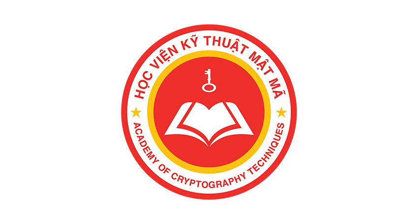

<div align="center">
  
  <h1>Database_Carving-InSQL</h1>
  
  <p>
    <b>Phát hiện & Theo dõi lỗ hổng bảo mật thông qua phân tích lưu trữ vật lý (Database Carving)</b>
  </p>

<p>
    
    
    
    
  </p>
</div>

<br />

<details open>
  <summary><b>Mục lục</b></summary>
  <ol>
    <li><a href="#gioi-thieu">Giới thiệu</a></li>
    <li><a href="#van-de">Vấn đề & Giải pháp</a></li>
    <li><a href="#phuong-phap">Phương pháp kỹ thuật</a></li>
    <li><a href="#cai-dat">Cài đặt & Thực nghiệm</a></li>
    <li><a href="#ket-qua">Kết quả đạt được</a></li>
    <li><a href="#tac-gia">Tác giả</a></li>
  </ol>
</details>

## 📖 Giới thiệu <a name="gioi-thieu"></a>
Dự án **Database_Carving-InSQL** được thực hiện nhằm đánh giá tính khả thi và hiệu quả của kỹ thuật **Database Carving** trong việc phát hiện các hành vi vi phạm bảo mật, đặc biệt trong các tình huống **Audit Log bị vô hiệu hóa**.

Đề tài tập trung vào việc phân tích trực tiếp các file lưu trữ vật lý (data file) của cơ sở dữ liệu Oracle để tìm kiếm các "dấu vết số" (digital artifacts) còn sót lại ngay cả khi dữ liệu đã bị xóa (DELETE) hoặc cập nhật (UPDATE) mà không để lại vết trong Log.

## Để biết thêm chi tiết vui lòng tải file Database_Carving-InSQL.docx . Cảm ơn vì đã xem!

## ⚠️ Vấn đề & Giải pháp <a name="van-de"></a>

### Vấn đề: Insider Threat (Tấn công nội bộ)
* 30% các vụ vi phạm dữ liệu nhắm vào Database, thường do người nội bộ có quyền hạn cao thực hiện.
* Quản trị viên (DBA) có thể **vô hiệu hóa Audit Log** hoặc xóa dấu vết trước khi thực hiện hành vi xấu.
* Khi Log bị tắt, các phương pháp giám sát truyền thống trở nên vô hiệu.

### Giải pháp: Database Carving
Sử dụng kỹ thuật điều tra pháp y số (Digital Forensics) để đọc trực tiếp file `.DBF` (trong Oracle) ở cấp độ nhị phân (binary), bỏ qua hoàn toàn tầng SQL và Audit Log.

## ⚙️ Phương pháp kỹ thuật <a name="phuong-phap"></a>
Dự án sử dụng phương pháp **Disk Forensics** kết hợp với **Python** để giải mã cấu trúc file dữ liệu:

1.  **Thu thập:** Sao chép nguyên vẹn file vật lý (ví dụ: `FORENSIC01.DBF`).
2.  **Phân tích cấu trúc Page:** Dựa trên cấu trúc Data Block của Oracle để xác định header, row directory và free space.
3.  **Pattern Matching:** Quét các byte đặc trưng trong row header để tìm các bản ghi bị đánh dấu là "deleted" nhưng chưa bị ghi đè.


## 🛠 Cài đặt & Thực nghiệm <a name="cai-dat"></a>

### Yêu cầu hệ thống
* **OS:** Windows/Linux
* **Database:** Oracle Database 21c (Enterprise/Express Edition) 
* **Ngôn ngữ:** Python 3.x
* **Thư viện:** `struct`, `os`, `re`, `cx_Oracle` (tùy chọn) 

### Các bước tái hiện thực nghiệm
1.  **Thiết lập Database:**
    Chạy script SQL để tạo bảng `USER1.NHANVIEN` và thêm dữ liệu mẫu.
    ```sql
    CREATE TABLESPACE FORENSIC_TS DATAFILE 'FORENSIC01.DBF' SIZE 100M;
    -- (Xem chi tiết trong thư mục /sql)
    ```

2.  **Mô phỏng tấn công (Tắt Log):**
    Thực hiện tắt Audit và xóa dữ liệu để phi tang.
    ```sql
    NOAUDIT ALL ON USER1.NHANVIEN;
    DELETE FROM USER1.NHANVIEN WHERE MANV = 'NV003';
    -- Lúc này Audit Log sẽ không ghi nhận lệnh DELETE này.
    ```

3.  **Chạy Tool Carving:**
    Sử dụng script Python để quét file `.DBF`.
    ```bash
    python src/main.py --input data/FORENSIC01.DBF --target NHANVIEN
    ```

## 📊 Kết quả đạt được <a name="ket-qua"></a>

Sau khi chạy thực nghiệm, công cụ đã phát hiện thành công các hành vi mà Audit Log bỏ sót:

| Hành vi | Trạng thái Audit Log | Kết quả Carving | Ghi chú |
| :--- | :---: | :---: | :--- |
| **DELETE NV003** | ❌ Không ghi nhận | ✅ **Khôi phục thành công** | Tìm thấy tại Block X, Offset Y  |
| **UPDATE NV004** | ❌ Không ghi nhận | ✅ **Phát hiện giá trị cũ/mới** | [cite_start]Lương thay đổi: 45tr -> 55tr  |
| **INSERT NV011** | ❌ Không ghi nhận | ✅ **Phát hiện** | Nhận diện bản ghi mới  |

> **Kết luận:** Kỹ thuật Database Carving hoạt động hiệu quả và độc lập, không phụ thuộc vào cơ chế Log của hệ quản trị.

## 👥 Tác giả <a name="tac-gia"></a>
Đề tài nghiên cứu khoa học - **Học viện Kỹ thuật Mật mã** .

* **Sinh viên thực hiện:**
    * Nguyễn Trung Kiên (AT200432)
* **Giảng viên hướng dẫn:** ThS. Nguyễn Thị Thu Thuỷ

---
<div align="center">
  <i>Dự án này phục vụ mục đích học tập và nghiên cứu bảo mật. Vui lòng không sử dụng cho mục đích xấu.</i>
</div>
